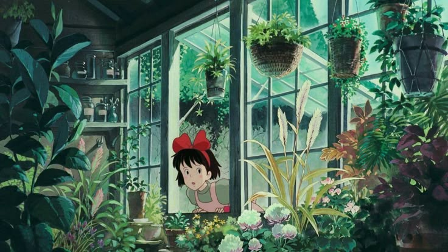
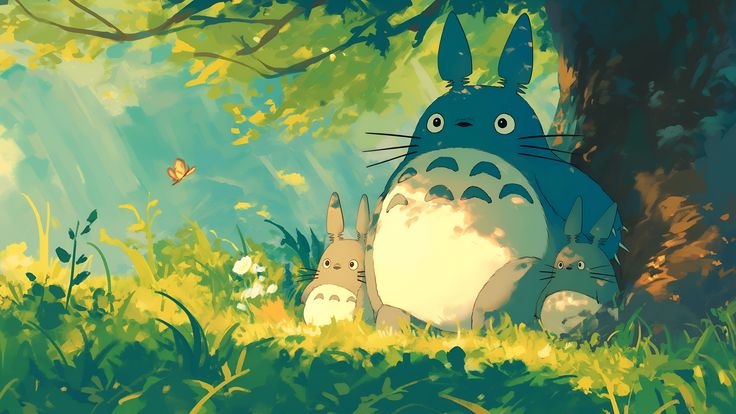
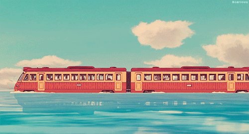

  

_"You cannot alter your fate. However, you can rise to meet it."_

───── 🌿─────

### 🌿 Welcome to My Little Corner of the Internet

Hi, I'm **Astha** — a software engineer who believes in writing clean code, slow living, and finding beauty in small things.

🌿🌸🌙

### ✨ What I'm Up To
🌱 Currently learning: **System Design, DSA, Web Development** 
🔍 Exploring: **Cloud, IoT, ML, Edge Computing, Ethical Tech** 
✍️ Writing about: Tech, Life, and Curiosities 

───── 🌿─────

### 💡 Things I Believe In
Small consistent steps build great things 
Slow, mindful living makes better engineers 
Every project should leave the world a little better than before 

───── 🌿─────

### 🎨 Hobbies & Passion Projects
📚 Reading cozy fantasy books 
🎨 Digital art + DIY crafts 
🍞 Baking bread (especially banana bread!) 
🐾 Learning about dogs 
🌱 Gardening and watching little green things grow 
✏️ Sketching moments and ideas 
🍳 Cooking new recipes and experimenting in the kitchen 

───── 🌿─────

_To know more about me, reach me out on [LinkedIn](https://www.linkedin.com/in/phoenix333/) 🍃_

🌿🌸🌙

